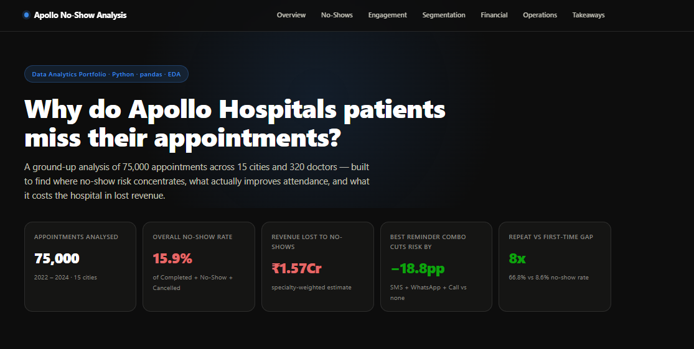
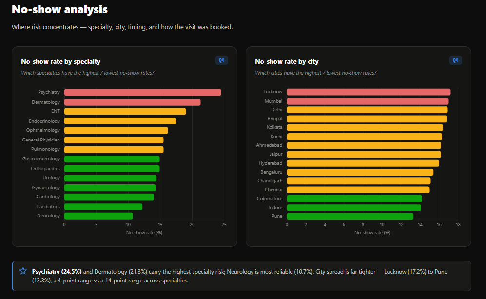
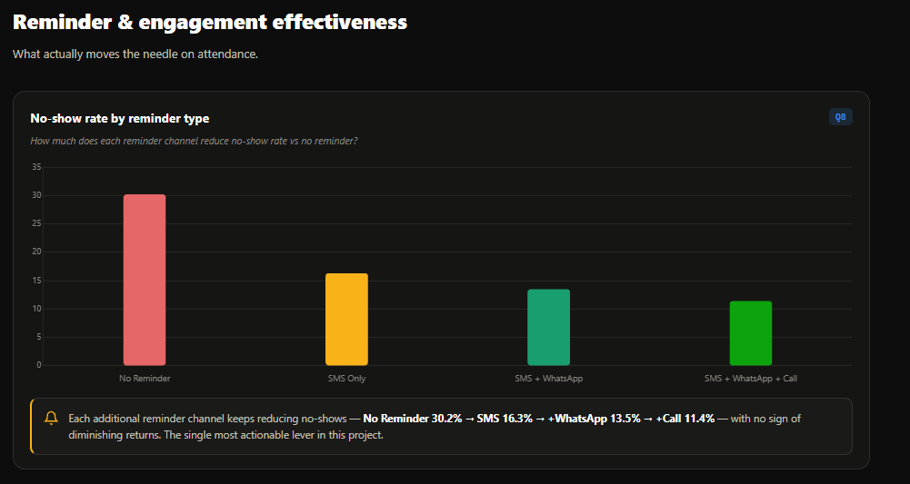
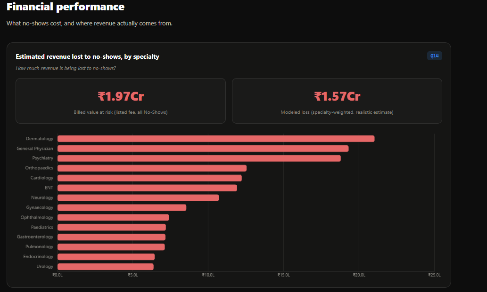
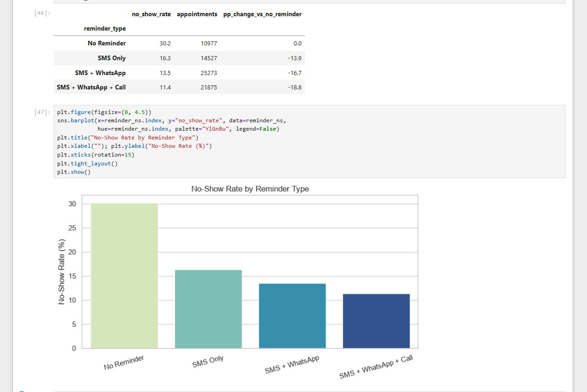

# Apollo Hospitals — Appointment No-Show & Patient Engagement Analysis

[](https://www.python.org/)
[](https://pandas.pydata.org/)
[](LICENSE)
[]()

An end-to-end exploratory data analysis of 75,000 hospital appointments, built to uncover why patients miss appointments, which interventions actually reduce no-shows, and what it costs the business — delivered as a notebook, a standalone script, and a recruiter-facing analytics dashboard.

**[View the Live Dashboard →](docs/Apollo%20Hospitals%20%E2%80%94%20No-Show%20%26%20Patient%20Engagement%20Analysis.html)**

---

## Table of Contents

- [Business Problem](#business-problem)
- [Key Business Questions](#key-business-questions)
- [Dataset Overview](#dataset-overview)
- [Data Preparation & Business Rules](#data-preparation--business-rules)
- [Analysis Methodology](#analysis-methodology)
- [Key Findings & Insights](#key-findings--insights)
- [Business Recommendations](#business-recommendations)
- [Technical Skills & Tools](#technical-skills--tools)
- [Project Structure](#project-structure)
- [How to Run This Project](#how-to-run-this-project)
- [Dashboard](#dashboard)
- [Notebook & Script](#notebook--script)
- [Screenshots](#screenshots)
- [Setup & Requirements](#setup--requirements)
- [License](#license)
- [Contact](#contact)

---

## Business Problem

Apollo Hospitals runs in-clinic, video, and home-visit appointments across 15 cities, booked through five channels (Apollo App, Website, Call Centre, Walk-In, Partner App). A significant share of booked appointments end in no-shows or cancellations — hurting doctor utilisation, revenue, and patient outcomes.

This project analyses 75,000 appointment records (2022–2024) and a 320-doctor reference table to answer: **who no-shows, why, and what can Apollo actually do about it.**

## Key Business Questions

The analysis answers 21 structured business questions across six areas:

**A. Business Overview**
1. Appointment volume trend, 2022–2024
2. Split of outcomes (Completed / No-Show / Cancelled / Scheduled)
3. Highest-volume booking channels

**B. No-Show Analysis**
4. No-show rate by specialty and city
5. Effect of booking lead time on no-shows
6. Effect of time of day and weekend bookings
7. Risk by appointment type and booking channel

**C. Reminder & Engagement Effectiveness**
8. Impact of reminder type on no-show rate
9. Whether prior no-show history predicts future no-shows
10. Whether membership and repeat-visit status improve attendance

**D. Patient & Demographic Segmentation**
11. Influence of age, gender, and chronic condition on no-shows
12. Most common visit reasons and their no-show rates
13. Patient age distribution in Paediatrics, Gynaecology, and Psychiatry

**E. Financial Performance**
14. Estimated revenue lost to no-shows
15. Average revenue by specialty and appointment type
16. Revenue by city and payment mode mix
17. Effect of insurance coverage on out-of-pocket payment

**F. Doctor Utilisation & Service Quality**
18. Doctor utilisation by specialty
19. Patient wait times by specialty and time of day
20. Relationship between consultation duration and satisfaction
21. Relationship between doctor experience and consultation fee

## Dataset Overview

| Table | Rows | Columns | Description |
|---|---|---|---|
| `apollo_appointments_fact.csv` | 75,000 | 52 | One row per appointment: booking, patient, outcome, revenue, and quality fields |
| `apollo_doctors_dim.csv` | 320 | 15 | One row per doctor: specialty, experience, rating, standard fee |

Full field definitions are documented in [`data/Data Dictionary.docx`](data/Data%20Dictionary.docx).

**Outcome split across all 75,000 appointments:**

| Status | Count | % of Total |
|---|---|---|
| Completed | 55,275 | 73.7% |
| No-Show | 11,584 | 15.4% |
| Cancelled | 5,793 | 7.7% |
| Scheduled | 2,348 | 3.1% |

## Data Preparation & Business Rules

Four business rules were enforced consistently across every metric in this project:

1. **No-show rate** = No-Show ÷ (Completed + No-Show + Cancelled). Scheduled (future) appointments are excluded from every rate calculation — this gives an overall no-show rate of **15.9%**.
2. **Revenue metrics** are scoped to Completed appointments only — No-Show and Cancelled rows carry zero realized revenue by design.
3. **Quality metrics** (wait time, consultation duration, satisfaction, doctor utilisation) only exist for Completed appointments, since these columns are structurally null otherwise.
4. **`"None"` is a real category, not missing data** — in chronic condition, membership type, insurance provider, and cancellation reason, `"None"` means "Not Applicable" and was loaded with `keep_default_na=False` to prevent pandas from silently converting it to NaN.

Other cleaning steps:
- Date columns parsed and validated (zero unparseable dates, zero bookings made after their appointment date).
- Three business-rule DataFrames maintained throughout: `df` (all appointments), `resolved` (drops Scheduled — used for every no-show rate), `completed` (Completed only — used for every revenue/quality metric).
- Derived columns added: `year_month`, `year_quarter`, `is_weekend`, `lead_time_group`, `prior_no_show_group`, `chronic_flag`, `duration_band`.
- Doctor table joined via a validated left join (`validate="m:1"`) on `doctor_id`, bringing in only doctor-exclusive fields (experience, rating, standard fee) — row count and uniqueness confirmed unchanged after the join.
- **Data quality note:** all 2,348 Scheduled rows fall in December 2024, so that month has no completed-outcome data yet — expected, not a bug. A small number of patients under 13 also appear in the Gynaecology and Psychiatry age distributions — flagged as a data observation rather than silently filtered.

## Analysis Methodology

- **Tooling:** Python (pandas, numpy) for data manipulation; matplotlib and seaborn for visualization; scipy.stats for correlation testing.
- **Approach:** a single reusable helper function (`no_show_rate_by()`) computes no-show rate and sample size for any grouping column, applied consistently across all 10+ no-show questions.
- **Validation discipline:** every join and filter was checked with row-count and null assertions before being used downstream (see the notebook's inline validation cells).
- **Statistical testing:** Pearson correlation with p-values used for both relationship questions (Q20, Q21) rather than eyeballing scatter plots.

## Key Findings & Insights

**Overall scale**
- 15.9% overall no-show rate (resolved basis); 15.4% of all bookings end as a No-Show outright.
- Estimated revenue lost to no-shows: **₹1.57 Cr** (specialty-weighted model) against a listed-fee-at-risk of ₹1.97 Cr.

**Where risk concentrates**
- Highest no-show specialties: **Psychiatry (24.5%)**, **Dermatology (21.3%)**, **ENT (19.0%)**. Lowest: Neurology (10.7%), Paediatrics (12.2%).
- Highest no-show cities: Lucknow (17.2%), Mumbai (17.0%), Delhi (16.9%). Lowest: Pune (13.3%), Indore (14.1%).
- **Home Visit (26.2%)** and **Video Consult (21.1%)** carry far more no-show risk than In-Clinic (12.2%).
- Walk-In bookings (20.9%) are riskiest by channel; the Apollo App (14.2%) is the most reliable.

**What predicts risk**
- **Reminders work, and the effect compounds**: No Reminder 30.2% → SMS Only 16.3% → +WhatsApp 13.5% → +Call 11.4% (**−18.8 percentage points**, with no sign of plateauing). This is the single strongest lever found in the data.
- **Prior no-show history is a clean, escalating predictor**: 15.2% (0 priors) → 20.3% (1) → 26.7% (2) → 32.7% (3+) — patients with 3+ prior no-shows are over 2x as likely to no-show again.
- **First-time patients no-show at ~8x the rate of repeat patients** (66.8% vs 8.6%) — the single biggest factor in the entire dataset.
- Apollo members no-show less than non-members (12.7% vs 16.9%).
- Longer booking lead time increases risk: same-day/1-day bookings run 13–16%, rising steadily to 20.0% for 15–30 day lead times.
- Evening (18.4%) and weekend (18.7%) bookings run meaningfully higher than morning (13.7%) and weekday (14.8%) bookings.

**Who is at risk**
- Age and gender show only mild variation (Adults 31–45 highest at 18.0%; Seniors lowest among adults at 14.0%); chronic condition shows almost no difference (16.0% vs 15.9%) — attendance risk is driven far more by behaviour (reminders, prior history, repeat status) than by demographics.
- Visit reasons are fairly uniform in risk (14.6%–16.8%), so no single reason stands out as disproportionately risky.

**Financial picture**
- Average revenue per completed appointment is highest in Psychiatry (₹2,640) and lowest in General Physician (₹633); Home Visit (₹1,960) generates more average revenue than In-Clinic (₹1,300) or Video Consult (₹1,098).
- Bengaluru, Delhi, and Mumbai are the top three cities by total revenue.
- Insurance meaningfully reduces patient cost: insured patients pay ₹859 on average (55.1% of the fee) vs ₹1,563 (100%) for uninsured — but **39.9% of insured Completed appointments show a ₹0 insurer payout**, a gap worth investigating with the billing team.

**Operational picture**
- Doctor utilisation sits in a tight 76.2%–77.3% band across all specialties — no single specialty is a clear bottleneck.
- Wait times are similarly tight (11.2–12.0 minutes mean, 8-minute median) regardless of specialty or time of day.
- **Consultation duration has no relationship with patient satisfaction** (r = −0.004, p = 0.41 — not statistically significant); satisfaction holds flat at 4.07 regardless of visit length.
- **Doctor experience is significantly correlated with consultation fee** (r = 0.278, p < 0.0001); average fee rises steadily from ₹1,320 (2–5 yrs experience) to ₹1,850 (21+ yrs).

## Business Recommendations

- **Scale up multi-channel reminders** (SMS + WhatsApp + Call) as the default for all bookings — it is the single most actionable, proven lever (−18.8pp).
- **Flag patients with 2+ prior no-shows** for a mandatory confirmation call before the visit.
- **Target first-time patients** specifically — their no-show rate is nearly 8x that of repeat patients, making onboarding/confirmation workflows for new patients a high-leverage investment.
- **Review Home Visit and Video Consult scheduling** given their materially higher no-show rates (26.2% / 21.1%) relative to In-Clinic (12.2%).
- **Investigate the insurance claim gap** — nearly 40% of insured Completed appointments show zero insurer payout, which could indicate claim rejections, deductibles, or a data/process issue worth billing-team review.

## Technical Skills & Tools

| Category | Tools / Techniques |
|---|---|
| Languages | Python |
| Data manipulation | pandas, numpy |
| Visualization | matplotlib, seaborn |
| Statistical analysis | scipy.stats (Pearson correlation, significance testing) |
| Environment | Jupyter Notebook |
| Techniques | Data cleaning & validation, business-rule-driven filtering, table joins with integrity checks, derived feature engineering, groupby aggregation, correlation analysis, dashboard storytelling |

## Project Structure

```
Apollo_Hospitals_Project/
├── assets/
│   └── screenshots/
│       ├── 01_hero_kpis.png
│       ├── 02_noshow_by_specialty.png
│       ├── 03_reminder_effect.png
│       ├── 04_revenue_lost.png
│       └── 05_notebook_execution.png
├── data/
│   ├── apollo_appointments_fact.csv
│   ├── apollo_doctors_dim.csv
│   └── Data Dictionary.docx
├── docs/
│   └── Apollo Hospitals — No-Show & Patient Engagement Analysis.html
├── notebooks/
│   └── Apollo_Hospitals_EDA_Notebook.ipynb
├── scripts/
│   └── apollo_full_script.py
├── .gitignore
├── LICENSE
├── README.md
└── requirements.txt
```

## How to Run This Project

1. Clone the repository and navigate into it.
2. Install dependencies:
```
   pip install -r requirements.txt
```
3. **Option A — Notebook:** open `notebooks/Apollo_Hospitals_EDA_Notebook.ipynb` in Jupyter and run all cells in order.
4. **Option B — Script:** run the standalone script from the repository root (so the relative `data/` path resolves):
```
   python scripts/apollo_full_script.py
```
5. **Option C — Dashboard:** open `docs/Apollo Hospitals — No-Show & Patient Engagement Analysis.html` directly in a browser — no installation required.

## Dashboard

The full interactive dashboard — KPIs, charts, and insights for all 21 questions — is in [`docs/`](docs/Apollo%20Hospitals%20%E2%80%94%20No-Show%20%26%20Patient%20Engagement%20Analysis.html) and is also published via GitHub Pages:

**Live link:** `https://kavitakanwar1190.github.io/apollo-hospitals-noshow-analysis/Apollo%20Hospitals%20%E2%80%94%20No-Show%20%26%20Patient%20Engagement%20Analysis.html`

## Notebook & Script

- **Notebook:** [`notebooks/Apollo_Hospitals_EDA_Notebook.ipynb`](notebooks/Apollo_Hospitals_EDA_Notebook.ipynb) — the full cell-by-cell analysis with executed outputs, covering setup, cleaning, the doctor join, and all 21 business questions with charts and insights.
- **Script:** [`scripts/apollo_full_script.py`](scripts/apollo_full_script.py) — a standalone, non-interactive version of the same analysis that reproduces every result end-to-end from the command line.

## Screenshots

| | |
|---|---|
|  |  |
| **Dashboard overview — key KPIs** | **No-show rate by specialty** |
|  |  |
| **Reminder-type effectiveness** | **Estimated revenue lost to no-shows** |
|  | |
| **Executed notebook cell (reminder analysis)** | |

## Setup & Requirements

This project uses the following exact library versions (see [`requirements.txt`](requirements.txt)):

```
pandas==3.0.1
numpy==2.4.3
matplotlib==3.11.2
seaborn==0.13.2
scipy==1.18.1
```

## License

This project is licensed under the MIT License — see [`LICENSE`](LICENSE) for details.

## Contact

**Name:** Kavita Kanwar Naruka
**Email:** [kavita.kanwar1190@gmail.com](mailto:kavita.kanwar1190@gmail.com)
**LinkedIn:** [linkedin.com/in/kavita-kanwar1190](https://linkedin.com/in/kavita-kanwar1190)
